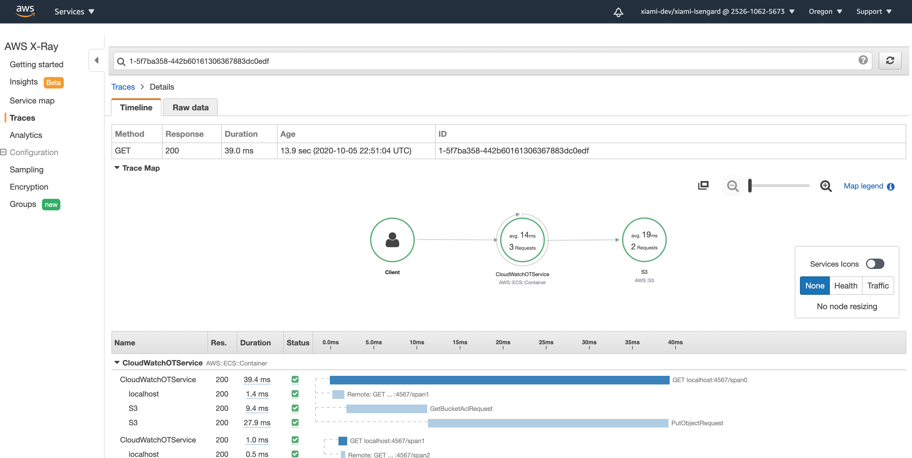

### Run AWSOTelCollector Beta Examples with Docker

This example will introduce how to run AWSOTelCollector Beta in the Docker container. This example uses a AWS data emitter container image that will generate Open Telemetry Protocol (OTLP) format based metrics and traces data to AWS CloudWatch and X-Ray consoles.  

Please follow the steps below to try AWS OTel Collector Beta.


#### Prerequisite

To retrieve your ```AWS_ACCESS_KEY_ID```, ```AWS_SECRET_ACCESS_KEY``` and ```AWS_REGION``` for the following example, please see https://docs.aws.amazon.com/cli/latest/userguide/cli-configure-files.html for setting up your AWS credentials.

#### Steps,

1. Download the source code of this repo and edit the following section in ```docker-compose.yaml``` under ```examples``` folder. You will need to export your AWS credentials and region with these 3 environment variables ```AWS_ACCESS_KEY_ID```, ```AWS_SECRET_ACCESS_KEY``` and ```AWS_REGION``` in the config below. The region is where the data will be sent to.
```# Agent aws-otel-collector:
    image: aottestbed/awscollector:v0.1.12
    command: ["--config=/etc/otel-agent-config.yaml", "--log-level=DEBUG"]
    environment:
      - AWS_ACCESS_KEY_ID=<to_be_added>
      - AWS_SECRET_ACCESS_KEY=<to_be_added>
      - AWS_REGION=<to_be_added>
    volumes:
      - ../config.yaml:/etc/otel-agent-config.yaml // use default config
      - ~/.aws:/root/.aws
    ports:
      - "1777:1777"   # pprof extension
      - "55679:55679" # zpages extension
      - "55680:55680" # OTLP receiver
      - "13133"       # health_check 
```
2. Once your own docker image and AWS credential has been updated in the ```docker-compose.yaml``` file, run the following make command.
```
make docker-compose
```
3. Now you can view you data in AWS console

    * X-Ray - aws console
    * CloudWatch - aws console  
    
**AWS Metrics Sample Data**   
*   
**AWS Traces Sample Data**
*   

4. Stop the running AWSOTelCollector in Docker container
```
make docker-stop
```
